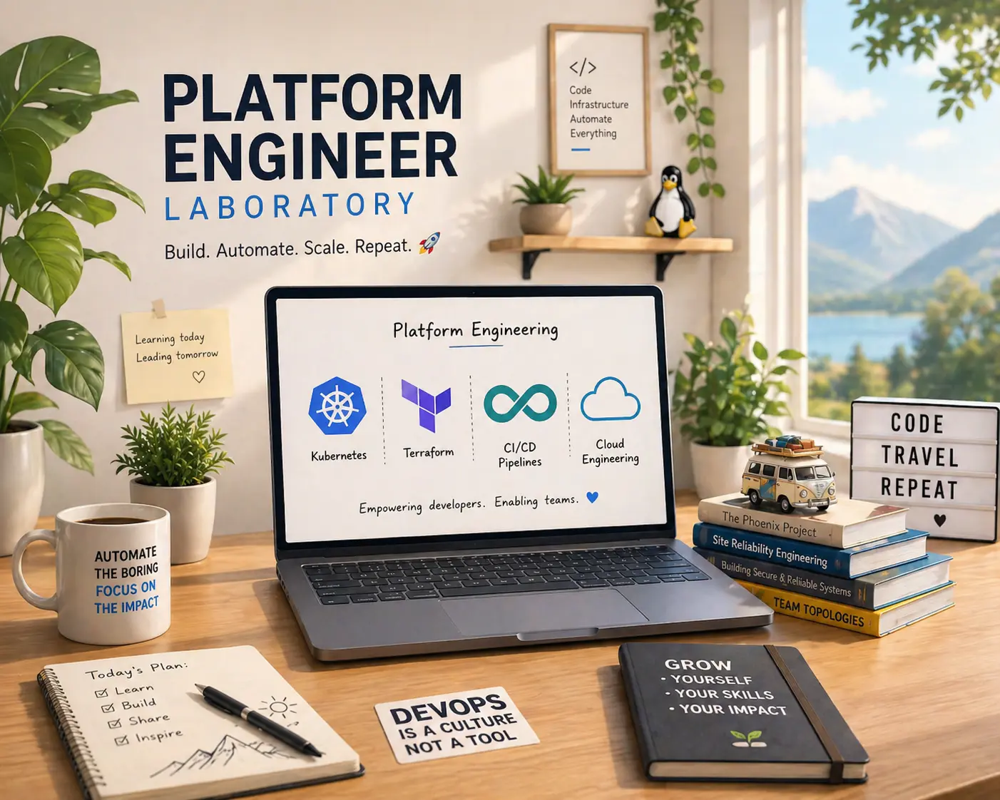

# pe-lab — Acme Corp Internal Developer Platform

> A production-like IDP running on local Kubernetes, built to demonstrate real-world platform engineering patterns for developer onboarding and day-to-day workflows.



---

## What is this?

**pe-lab** is a self-contained Internal Developer Platform (IDP) for a fictional company **Acme Corp**. It gives developers a single place to discover services, manage infrastructure, read docs, and get productive on a project — without hunting through wikis or asking the platform team.

The stack mirrors what you'd find in a real mid-size engineering org: a developer portal backed by a service catalog, GitOps-driven deployments, policy enforcement, and observability — all runnable on a laptop.

---

## Stack

| Layer | Tool |
|---|---|
| Developer portal | [Backstage](https://backstage.io) |
| Container orchestration | Kubernetes (Kind) |
| GitOps | Argo CD |
| Infrastructure provisioning | Crossplane |
| Policy enforcement | Kyverno |
| Observability | kube-prometheus-stack |
| IaC bootstrap | Terraform |

---

## Developer Onboarding

New to the project? Three steps:

```bash
# 1. Bootstrap the local cluster
bash scripts/backstage.sh

# 2. Open the developer portal
open http://localhost:3000

# 3. Browse the service catalog, pick a component, read its TechDocs
```

From the portal you can:
- Explore the **service catalog** — components, APIs, systems, owners
- Manage **infrastructure resources** (VMs, databases) via the VM Manager plugin
- Launch self-service workflows from the **Service Portal** plugin
- Read TechDocs directly in the browser

---

## Repo Structure

```
pe-lab/
├── backstage/
│   ├── app-config.yaml        # Backstage configuration (DB, Redis, GitHub)
│   ├── catalog/               # Catalog entities: services, VMs, users, groups
│   ├── plugins/
│   │   ├── service-portal/    # Self-service actions plugin
│   │   └── vm-manager/        # VM inventory & management plugin
│   └── Dockerfile
├── helm/
│   └── backstage/             # Helm chart values for cluster deployment
├── kubernetes/                # Argo CD app-of-apps, Kyverno policies, Crossplane
├── terraform/                 # Kind cluster + Argo CD bootstrap
├── docs/                      # TechDocs-compatible documentation
├── scripts/
│   └── backstage.sh           # One-command local bootstrap
└── img/
    └── pe_lab.webp            # Architecture diagram
```

---

## Local Prerequisites

- Docker Desktop
- `kubectl`, `helm`, `terraform`
- Node.js 20+ / Yarn (for local Backstage development)

---

## Configuration

Backstage reads environment variables at startup. Copy and fill in:

```bash
APP_BASE_URL=http://localhost:3000
BACKEND_BASE_URL=http://localhost:7007
POSTGRES_HOST=localhost
POSTGRES_PORT=5432
POSTGRES_USER=backstage
POSTGRES_PASSWORD=backstage
REDIS_HOST=localhost
REDIS_PORT=6379
GITHUB_TOKEN=ghp_...
```

For local development without a cluster, use `docker compose`:

```bash
cd backstage
docker compose up
```

---

## Custom Plugins

| Plugin | Purpose |
|---|---|
| `service-portal` | Self-service catalog actions for developers |
| `vm-manager` | View and manage VM resources from the catalog |

---

## Contributing

1. Fork the repo and create a feature branch
2. Check the catalog entities in [backstage/catalog/](backstage/catalog/) to understand the domain model
3. Open a PR — Argo CD picks up changes automatically after merge
